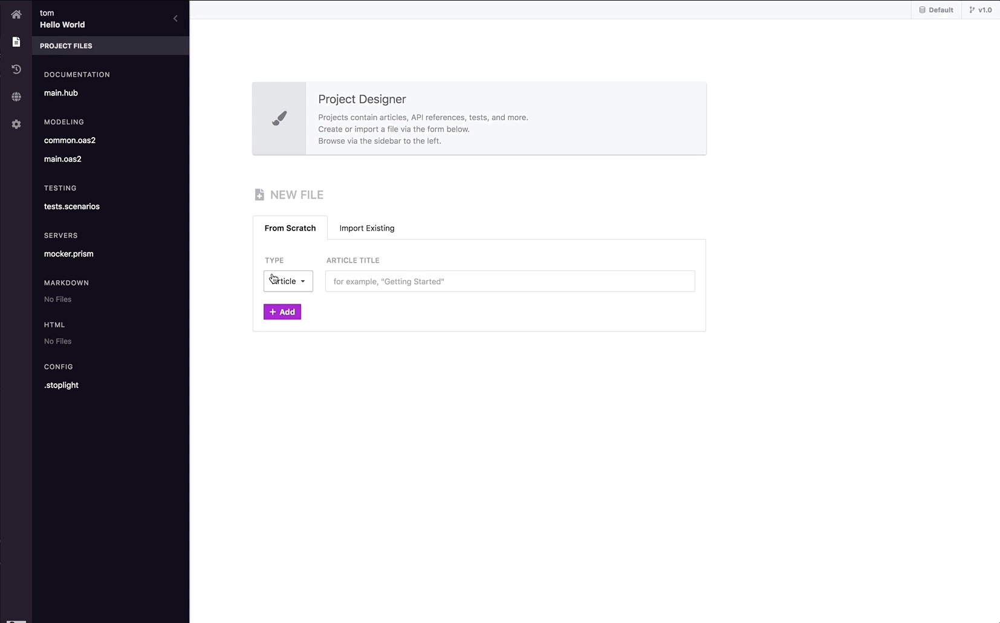
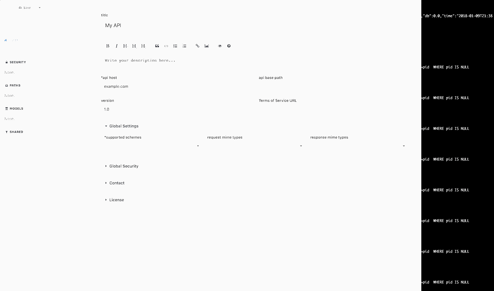
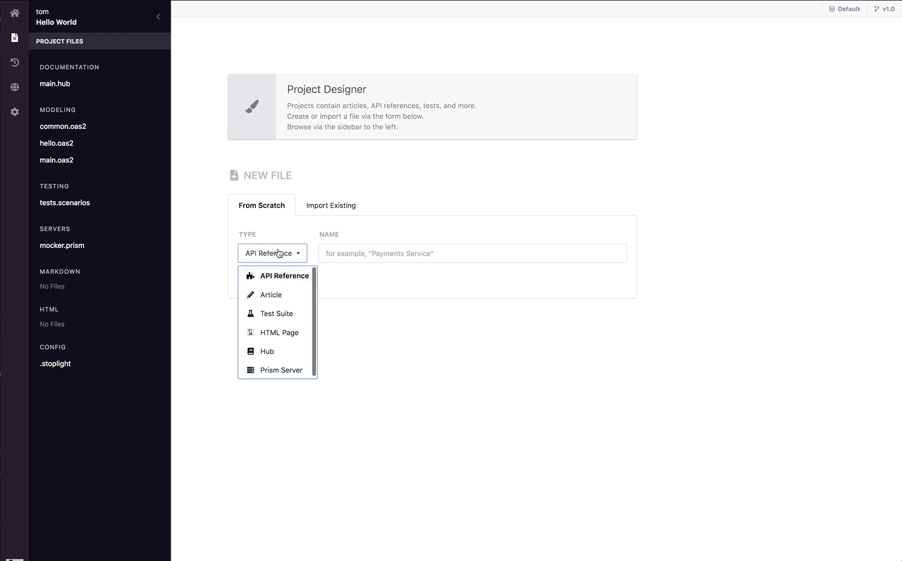
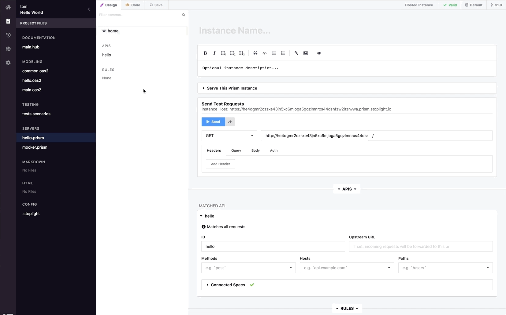
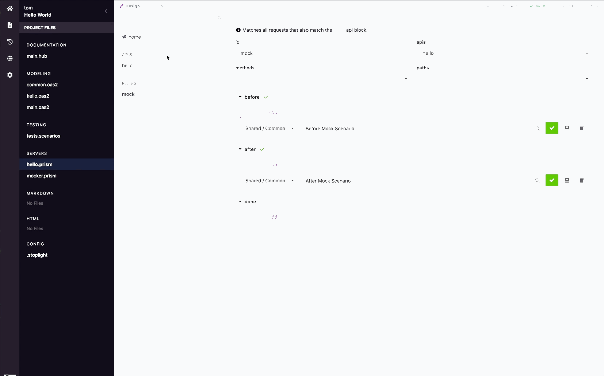

# Setting Up a Prism Mock Server

Mock servers are great for quickly standing up a fake (sometimes referred to as virtualized) version of your web service. Among other things, you can use mock servers to:

1. **Parallelize and Speed Up Development** 
    - Frontend teams can build against the mocked API while the backend team implements the real API.
2. **Increase the Accessiblity of your API** 
    - Customers can build implementations on top of your API before committing to a paid account.
3. **Make Testing Easier** 
    - APIs (particularly microservices) usually make calls to other APIs. Those other APIs might, in turn, make calls to even more APIs. This creates a dependency chain nightmare. During testing, you can use mock servers to cut that dependency chain off at the start.

If you are coming from Stoplight Classic (Version 2), you will notice that there is a little bit more setup involved.

## Hosted Mock Server Steps

_Note: Learn everything about modeling APIs [here](../modeling/modeling-introduction.md)._

1. Create a **new Stoplight project**.
2. Create a **OAS (Swagger 2) modeling file** within that project. Name it `hello.oas2`. 



3. Add a `GET /hello` operation to your new OAS specification.
4. Add a **200 response** to the operation, with the example JSON described below. 
```json
{
  "hello": "api"
}
```
5. **Save** the OAS file.



6. Create a new **Prism instance file** in the project. Name it `hello-mock.prism`.
7.  Add an API to the Prism instance and connect the `hello.oas2` specification that you created earlier.

<callout> Prism instances are made up of APIs and Rules, you can learn more about them here. </>



8. Add a **new rule** that you will setup to power mocking. 

<callout> Rules simply apply scenarios to HTTP traffic passing through the Prism instance. </>

9. Connect the **rule** to the API by clicking on the  `apis` dropdown input and selecting the previously created API.   . 
10. Add a **scenario** that will perform the mocking. We have an official Stoplight mock scenario [here](https://next.stoplight.io/stoplight/prism?edit=%23%2Fscenarios%2Fmock), which makes it easy to get started.
    1. Add a scenario to the `before` section of your rule.
    2. Select `Common / Shared` and set the target to `Before Mock Scenario`.
    3. Add a scenario to the `after` section of your rule, select `Common / Shared` and set the target to `After Mock Scenario`.

<callout> This mock scenario should suit most of your mocking use cases. For advanced use cases, please send us a message and we would love to help out. </>



11. **Save** your Prism instance. 

<callout> To verify your mock server is working, click on the `Home` link at the top of the Prism instance sidebar and send a test request to `GET /hello`. You should see a 200 response that equals the example you set in your OAS file earlier! </>



# Running Your Prism Server Locally

In the previous section, you learned how to create a simple Prism instance that is hosted by Stoplight. It is a powerful, accessible tool that allows your frontend and backend teams to work simultaneously. But the hosted Prism instance might not work behind your company firewall or you might want to run Prism locally on your desktop. Well, you are in luck! Prism is easy to install and run.

## Local Mock Server Steps

1. Install [Prism](https://github.com/stoplightio/prism). Make sure to install Prism Next. The version should be >= `2.0.0`.
2. Open up your terminal. 
3. Log into Stoplight Next with the `prism login` command and enter your Stoplight Next credentials. Once you are logged in, you will have access to your private and all public projects.
4. Get the export link for the Prism mock instance you created above.
5. Run `prism serve {export-link} --debug` and open this [link](http://localhost:4010/helloWorld).


# Recap

You now have a fully functional prism mock server. We have created a public project full of useful prism resources. We encourage you to explore the other prism helpers which are located [here](https://next.stoplight.io/stoplight/prism/blob/master/helpers.scenarios.yml). Let us know what you think. We are excited to see what you do.

For the more experienced Prism user, we have set up some advanced prism instances in the official Stoplight Next [Prism Project](https://next.stoplight.io/stoplight/prism).
